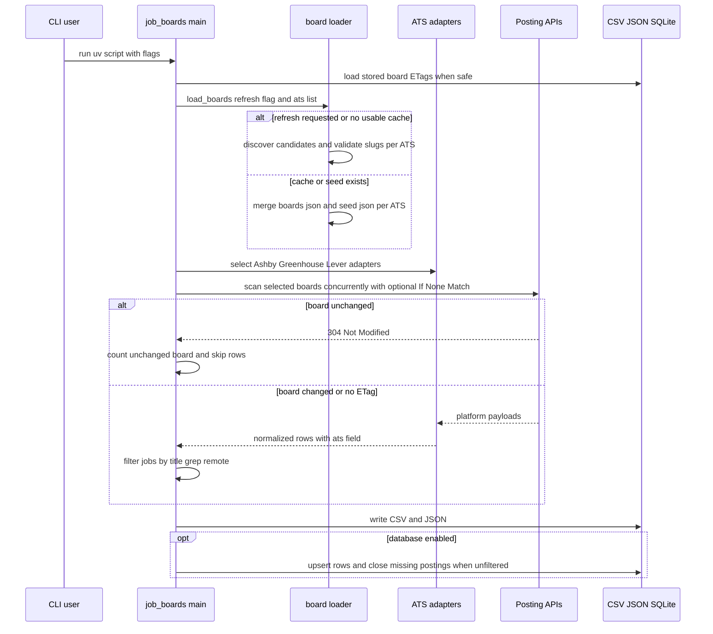

# Architecture overview

`/job_boards.py` is a single-file CLI organized around two phases: discover or load board slugs per ATS, then scan those boards for postings. The [board discovery workflow](../workflows/board-discovery.md) supplies the slug universe, the [job scrape workflow](../workflows/job-scrape.md) applies user filters and per-ATS normalizers, and the [data model](data-model.md) persists the flattened results.

## Runtime flow

This diagram follows `main()`, `load_boards()`, `SOURCES`, `scan_board()`, and `save()` in `/job_boards.py`.

## Main components

| Component | Source | Responsibility |
|---|---|---|
| CLI parser | `/job_boards.py` `main()` | Validates flag combinations, parses `--ats`, compiles optional grep regex, derives default title behavior, selects board subset, orchestrates scanning and writing. |
| HTTP client | `/job_boards.py` `fetch()`, `_single_request()`, `_pooled_request()`, `_retry_delay()` | Adds `User-Agent`, gzip, and optional `If-None-Match` headers; reuses per-thread connections for posting API hosts; lowercases response headers; captures ETags for safe runs; decompresses gzip responses; maps 304 to `NotModified`, 404 to `NotFound`, and 503 to `RateLimited`; backs off on throttling responses `429` and `403` using seconds-form `Retry-After` capped at 30 seconds; and retries transient 5xx/URL errors or one dead pooled connection. |
| ATS adapters | `/job_boards.py` `SOURCES`, `normalize_ashby()`, `normalize_greenhouse()`, `normalize_lever()` | Define archive domains, posting API URL templates, payload job extraction, optional content parameters, and normalization into the shared row shape. |
| Board loader | `/job_boards.py` `load_boards()` | Merges generated `boards.json` and `/boards.seed.json` by platform, or calls discovery for each selected ATS on `--refresh-boards`. |
| Scanner | `/job_boards.py` `scan_board()` | Fetches one platform board with an optional board ETag, validates payload shape, normalizes jobs, filters rows, and retains only grep fragments from descriptions. |
| Persistence | `/job_boards.py` `save()`, `load_etags()`, `save_etags()` | Creates or migrates the SQLite tables, upserts jobs by `(ats, posting id)`, preserves posting history, stores per-board ETags for conditional requests, and stamps `closed_at` only when coverage is exhaustive. |

## Design constraints

The architecture exists because Ashby, Greenhouse, and Lever expose public per-company posting APIs but no global search endpoint. `SOURCES` records the API URL template for each platform, so every global search becomes many per-board reads coordinated by [board discovery](../workflows/board-discovery.md).

The scraper treats platform payloads as adapter input rather than a shared schema. Ashby uses `title` and `isListed`, Greenhouse nests `location` and has integer ids, and Lever uses `text` for the title and epoch-millisecond `createdAt`. Keeping those rules in normalizers lets the [job scrape workflow](../workflows/job-scrape.md) and [data model](data-model.md) stay platform-agnostic after row construction.

Descriptions are intentionally bounded. Ashby and Lever return description text in the normal board payload, but Greenhouse requires `?content=true`, which the README documents as roughly 26x the bytes for a measured board. `scan_board()` only requests Greenhouse content when `--grep` is set, strips markup through `plain_text()`, stores at most two surrounding fragments from `fragments()`, and never includes whole descriptions in output rows.

Concurrency is deliberately simple: `ThreadPoolExecutor(max_workers=args.concurrency)` fans out over `(ats, slug)` pairs in `main()`, and discovery validation uses the same pattern in `discover_boards()`. Posting API hosts share per-thread HTTP connections through `_POOLED_HOSTS` and `_CONNECTIONS`, while archive and urlscan requests still use `urlopen` because they are few, may redirect, and do not benefit from raw host pooling. Repeat `--all --new-only` scans can also send stored board ETags from the [data model](data-model.md); `may_use_etags()` restricts that optimization to runs where a 304 genuinely means there are no new postings to emit in the [job scrape workflow](../workflows/job-scrape.md). Common Crawl paging is separately throttled in [board discovery](../workflows/board-discovery.md).

## Error handling boundaries

- A 404 while scanning a board marks the `(ats, slug)` dead for the current run on the first attempt; if the run is not limited, the code rewrites `boards.json` without dead slugs for the selected platforms.
- Throttling responses `429` and `403` do not mark the board dead immediately. `fetch()` backs off, honours seconds-form `Retry-After` when present, caps that delay at 30 seconds, and only raises after retries are exhausted.
- Platform payloads that do not yield a jobs list raise `ValueError` so API shape changes fail loudly instead of looking like zero matches.
- `--all` cannot be combined with `--title` or `--grep`; only unfiltered scans have the standing to close missing postings in the [data model](data-model.md).
- Invalid `--ats` values exit before scanning; valid values come from `SOURCES`.
- Invalid grep regex exits before scanning; grep patterns without `\b` emit a warning because unbounded terms such as `rust` match words like `trust`.

## Historical notes

Git history explains why the architecture is shaped this way. The project began as a public Ashby board scraper. Later commits split the seed from the generated cache, added description grep, added SQLite accumulation, moved discovery to Wayback-first with `HEAD` validation, added `--all`, and added disappearance tracking through `closed_at`. The latest major source change generalized the design to Ashby, Greenhouse, and Lever by replacing single-platform constants with `SOURCES`, adding normalizers, and changing persistence to the composite `(ats, id)` key. When changing the architecture, preserve those hard-won boundaries unless source evidence shows they are obsolete.
