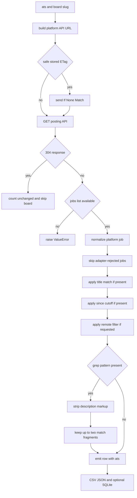

# Job scrape and search workflow

This workflow consumes slugs from [board discovery](board-discovery.md), calls each selected platform's per-board posting API, normalizes platform payloads, filters postings, and emits rows shaped by the [data model](../architecture/data-model.md). It is the main path engineers touch when changing user-visible CLI behavior.

## CLI filter semantics

`main()` in `/job_boards.py` defines the user contract:

- `--ats` selects `ashby`, `greenhouse`, `lever`, a comma-separated subset, or `all` by default. Unknown platforms exit before scanning.
- `--all` means every listed job on every scanned board. It cannot be combined with `--title` or `--grep`.
- `--title` filters titles. If no narrowing option is supplied, the default title is `software engineer`.
- `--grep REGEX` searches descriptions with a case-insensitive regex. If `--grep` is supplied without `--title`, the title filter is dropped instead of silently ANDing the default title.
- `--title` and `--grep` together are ANDed.
- `--since AGE` keeps postings whose normalized `publishedAt` parses at or after the cutoff from `parse_duration()`. Accepted forms are `7d`, `2w`, `3m`, `1y`, or a bare day count; missing or malformed dates are excluded because the flag promises freshness.
- `--new-only` removes rows whose `(ats, id)` already exists in SQLite via `known_keys()`. It is applied after board fetches so scanning stays storage-independent, and it exits early when combined with `--no-db`.
- `--sort board` keeps the default platform/company/title grouping; `--sort recent` puts the newest normalized `publishedAt` first and leaves undated postings last, which is the intended pairing for freshness runs such as `--since 1d`.
- `--remote` keeps only jobs whose normalized `isRemote` value is truthy. Ashby provides a remote flag, Greenhouse infers it from the location label, and Lever uses `workplaceType == "remote"`.
- `--limit` scans only the first N loaded boards per platform.
- `--concurrency` controls the thread-pool size and defaults to 8.

## Per-board scan flow

This flow shows the per-board filtering path before `main()` applies database-backed `--new-only` filtering.

`scan_board()` implements the branch logic through description matching; `main()` supplies ETags only when `may_use_etags()` says the run is safe, then applies `--new-only` against SQLite before writing outputs.

## Platform adapters

`SOURCES` keeps the external integration details in one place so the rest of the workflow can operate on normalized rows:

| ATS | API shape | Normalization notes |
|---|---|---|
| Ashby | Object with `jobs` list. | `normalize_ashby()` drops jobs where `isListed` is false and uses `descriptionPlain` or `descriptionHtml` for grep text. |
| Greenhouse | Object with `jobs` list. | `normalize_greenhouse()` converts integer ids to strings, reads nested `location.name`, infers remoteness from the location label, and uses `first_published` before `updated_at`. Descriptions require `?content=true`, requested only for `--grep`. |
| Lever | Payload is the jobs list. | `normalize_lever()` reads title from `text`, maps category fields, converts epoch-millisecond `createdAt` to ISO time, and combines description fields for grep text. |

`scan_board()` strips the private `_description` field before output, so the [data model](../architecture/data-model.md) never stores full descriptions.

## Title matching

`matches(job_title, wanted, mode)` has two modes:

- `exact`: case-insensitive and whitespace-trimmed equality.
- `fuzzy`: the query may be contained in the title, or the title may be contained in the query when the title has at least two words.

The two-word guard prevents a long query such as `senior software engineer` from matching every one-word title like `Engineer`, `Software`, or `Senior`. Empty title or empty query returns false.

## Description grep

`--grep` compiles a case-insensitive Python regex. `scan_board()` turns each adapter's `_description` value into plain text with `plain_text()`, extracts up to two context windows with `fragments()`, and joins them with ` … ` into the `matched` column. Full descriptions are not retained, which keeps this workflow compatible with the [data model](../architecture/data-model.md) and the README's memory/payload guidance.

The CLI warns when a grep pattern contains no `\b` word boundary because terms can match inside boilerplate words. The tests document the real footgun: `rust` also matches `trust`, while `\brust\b` avoids that false positive.

Greenhouse is the expensive case: its normal list endpoint omits descriptions, so `--grep` appends `content=true` and the CLI warns that this is roughly 26x the bytes of a normal Greenhouse run. Ashby and Lever already return description text in their list payloads.

## Conditional requests and board-level failures

For repeat `--all --new-only` scans with the database enabled, `main()` loads stored per-board ETags from the [data model](../architecture/data-model.md), passes them as `If-None-Match`, treats `NotModified` as an unchanged board with no rows to emit, and reports the `unchanged` count in progress output. The gate is intentionally narrow: `may_use_etags()` rejects title, grep, since, and remote filters because a 304 is only safe when the previous ETag came from a full persisted board fetch and the current run only needs newly unseen rows.

The worker function inside `main()` retries each board once for non-404 exceptions. A `NotFound` still marks the `(ats, slug)` dead on the first attempt. After an unlimited run, dead boards are pruned from generated `boards.json` for the selected platforms so future runs skip them. Limited runs do not rewrite the full cache.

Throttling responses are handled inside the shared HTTP client before the worker sees a board failure. `fetch()` now backs off on `429` and `403`, honours a seconds-form `Retry-After` header when present, caps that server-requested delay at 30 seconds, and only raises if the throttled response persists through the configured retries. This prevents a temporarily refused board from being dropped for the whole run while keeping true `404` boards cheap to discard.

Payload shape failures are not swallowed by `scan_board()`; missing or non-list jobs payloads raise `ValueError`. The surrounding worker logs the board after the second failed attempt and continues scanning others, which keeps broad scrapes resilient without hiding API-shape regressions in tests.

## Output writing

After optional `--new-only` filtering, `sort_rows()` orders rows by platform/company/title for the default `--sort board` mode, or by descending `publishedAt` for `--sort recent` after a stable board-order pre-sort. The ordered rows are then written to:

- `${out}.csv` using UTF-8 with BOM so Excel handles punctuation in locations.
- `${out}.json` as indented JSON rows.
- The SQLite database unless `--no-db` is set.

Only a run with no title, grep, since cutoff, or new-only filter passes its scanned `(ats, slug)` list as coverage to `save()`. That link to the [data model](../architecture/data-model.md) is what allows disappearance tracking without confusing filtered misses for closed postings.

## Change guidance

When adding a filter, decide whether it narrows coverage and update `may_close_postings()` in the same change. If it does, it should prevent closing missing postings just like title, grep, since, and new-only filters. Also decide whether the filter makes conditional ETag skips unsafe and update `may_use_etags()` with tests. When adding an ATS, add a `SOURCES` entry, a normalizer that fills the shared `FIELDS`, seed entries where useful, and tests in [testing](../testing.md) for URL construction, normalization, row shape, and expensive-description behavior.
